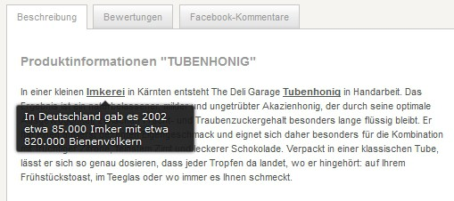
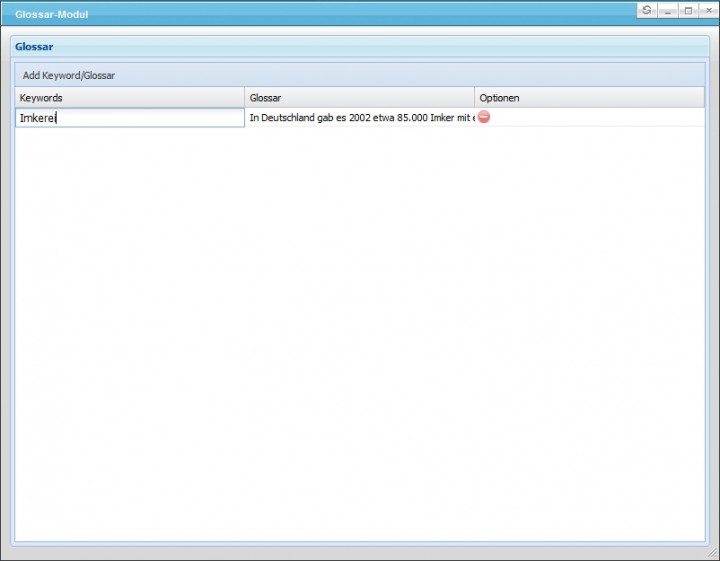

# SwagGlossar
> Working with Shopware version 4.1.0 to 5.1.1.
> Higher versions may work either but were not tested.

## Description
Use this plugin to provide additional information (i.e. a definition) when a customer rolls over a select term with their mouse in the item description.
All terms can be defined and managed in one central overview in the backend. 

## Images

## License

The MIT License (MIT). Please see [License File](LICENSE) for more information.
